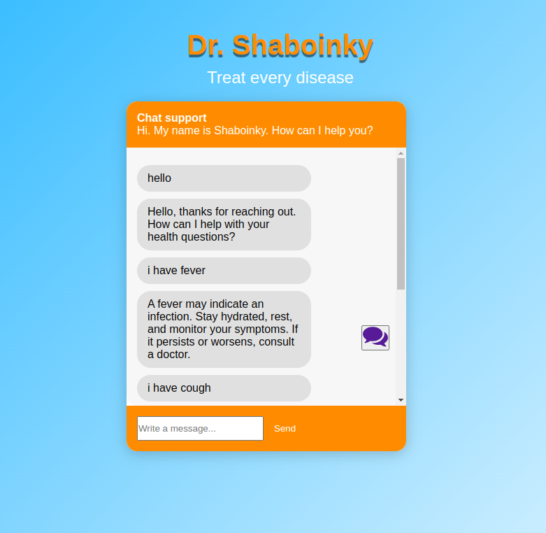

# ChatBot
An AI chatbot Mr.Shaboinky treats diseases and provides basic health advice based on user input and symptom descriptions.
# [Meet Dr. Shaboinky](https://healthchatbot-dr-shaboinky-2.onrender.com)

#Environment 
You have to create a conda environment to avoid any dependencies conflict

# Installing Dependencies
`pip install flask`
`pip install flask-cors`
`pip install torch`
`pip install nltk`
`pip install numpy`

# Running the Flask Server
`python model.py`
`python train.py`
`flask run`

# Running Frontend
1.Install liveServer
2.Click on Go Live # HealthChatbot_Dr.Shaboinky
